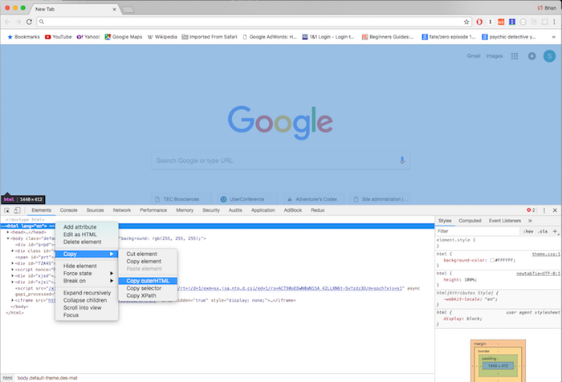

# Dom2Fixture

A simple utility to validate and transform VeriPy output files into the Specio format.

**UNDER DEVELOPMENT**

Dom2Fixture is a python module that extracts the important information about a page and outputs it to a VeriPy fixture file. This allows the user to quickly build VeriPy fixtures without having to manually select and copy elements.

At any time, run the following command to get help.

```bash
PYTHONPATH=. python -m dom2fixture --help
```


## Installing Dom2Fixture

Currently Dom2Fixture is not installed anywhere by default. To use Dom2Fixture locally, simply ensure that you have a valid virtual environment for Python 3.6 or later, and install the requirements with the following command.

```bash
cd glue/dom2fixture
pip install -r requirements.txt
```


## Running the Tests

TODO: No tests. But when there are, you'll use the following command to run them.

```bash
PYTHONPATH=. py.test
```


## Getting a Fixture from a Page

1. In your browser, navigate to the page you want to model, and open the inspector.
2. Copy the contents of the DOM to your clipboard.



3. (On macOS) run the following command to send the DOM through the converter.

```bash
pbpaste | PYTHONPATH=. python -m dom2fixture -o <destination>
```

> On Linux or Windows, you'll have to save the data to a file and then run it though.


## Adding New Extractors

Dom2Fixture easily allows developers to add new extractors to the output.

1. Add a new XPath selector to the list of extractors in `extract.py`. This will tell the extraction to pull out all of the new elements matching this criteria. Any valid XPath is valid here. The extractors is a Tuple of (XPath, formatter function).

```python
extractors = (
    # ...
    ('//a', formatters.format_link),
    # My new extractor goes here
    ('//directions/to/the/cheeseshop[type="open"], formatters.format_shop),
)
```

2. Add a formatter for the new extracted type. In some cases you can use a formatter that already exists. Check in `formatters` for one that might fit your needs. If not, add yours there.
